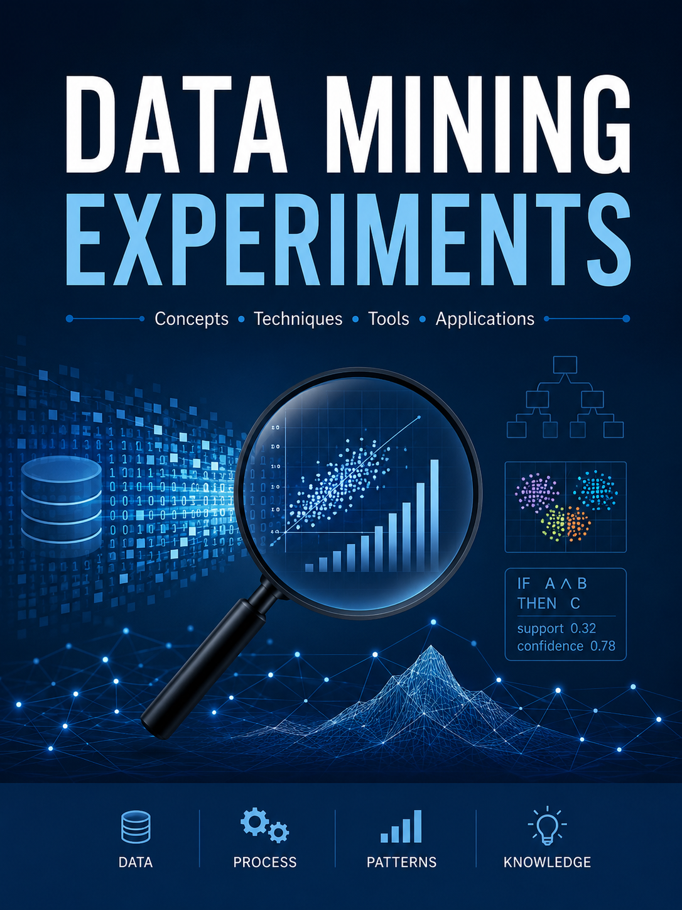

  

# Data Mining and Machine Learning Laboratory

A collection of practical Data Mining and Machine Learning experiments developed for undergraduate and postgraduate students.

## Objectives

This repository aims to provide hands-on implementations of fundamental Data Mining and Machine Learning algorithms using Python and real-world datasets.

## Topics Covered

### Data Preprocessing

* Data Cleaning
* Missing Value Handling
* Feature Scaling
* Encoding Techniques

### Classification

* Decision Trees
* K-Nearest Neighbors (KNN)
* Rule-Based Classification
* Naïve Bayes Classification
* Neural Network Classification

### Regression

* Linear Regression
* Regression Trees

### Clustering

* K-Means Clustering
* DBSCAN Clustering

### Association Rule Mining

* Market Basket Analysis

### Intelligent Systems

* Fuzzy Logic Controller

## Repository Contents

Each experiment includes:

* Problem Statement
* Dataset Description
* Python Implementation
* Results and Visualizations
* Conclusion

## Instructor

Dr. Rajesh Kumar

Assistant Professor

Electrical Engineering / AI & Data Science
